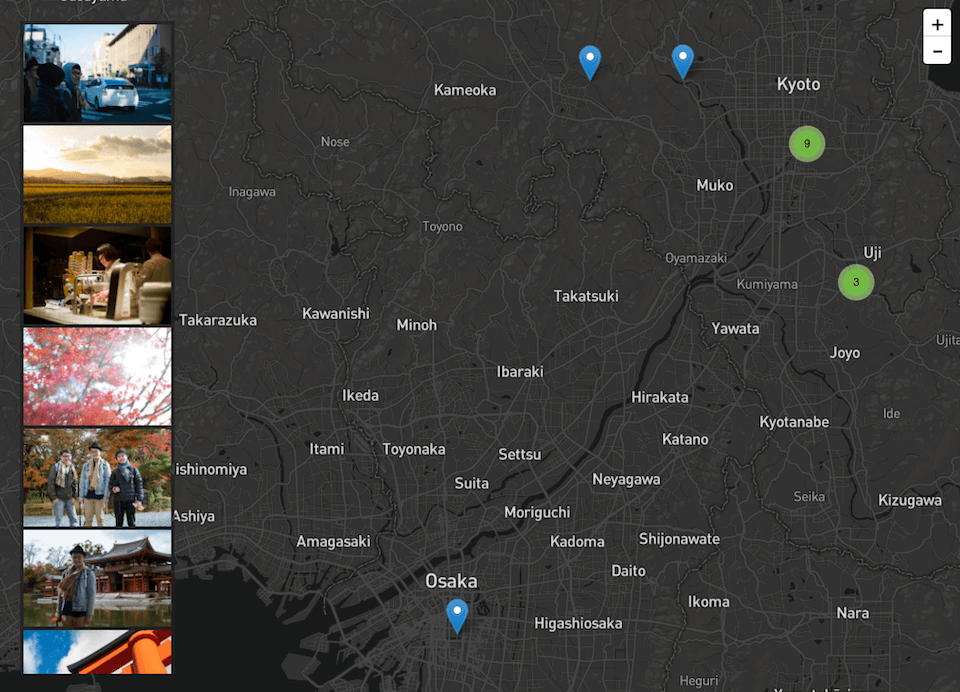

# Tourist

## TODO

* [ ] 支援多次上傳
* [x] 左側圖片使用縮圖
* [ ] 大量檔案上傳效能問題
* [ ] 左側圖片 lazy loading
* [ ] 捲動左邊照片欄右方地圖座標提示
* [ ] 點擊右方地圖座標同步捲動左側畫廊，並且顯示提示
* [ ] 左側欄位按照拍攝時間排序
* [ ] 把 Javascript 拉出改用 gulp 合併編譯壓縮（gulp）
* [ ] 把 CSS 拉出來用 SCSS 改寫 + minify（gulp）

## 授權（License）

保留所有權利（All Rights Reserved.）。
